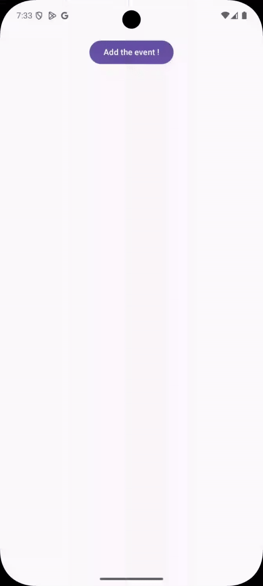
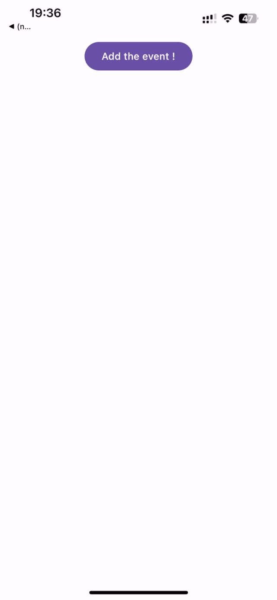

[](https://github.com/LotuxPunk/KalendarKit/actions/workflows/publish.yml)

# KalendarKit

## What is it?

KalendarKit is a Compose Multiplatform library designed to simplify the presentation of events for users to add. Using native APIs, KalendarKit allows developers to present a modal EventKit interface on iOS and open 
the default calendar application on Android, making it easier to allow user to add events.

## Example

<table>
  <tr>
    <td align="center"><b>Android</b></td>
    <td align="center"><b>iOS</b></td>
  </tr>
  <tr>
    <td></td>
    <td></td>
  </tr>
</table>

## How to use it?

### Add KalendarKit to your project

To use KalendarKit in your project, you need to add the following dependencies to your `build.gradle.kts` file:

```kotlin
commonMain.dependencies {
    implementation("be.vandeas:kalendar-kit:1.1.0")
}
```

or using version catalog:

```toml
[versions]
kalendar-kit = "1.1.0"

[libraries]
kalendar-kit = { module = "be.vandeas:kalendar-kit", version.ref = "kalendar-kit" }
```

### iOS

#### Permission

To use KalendarKit in your iOS application, you need to ask permission to access the calendar. You can do this by adding the following `NSCalendarsUsageDescription` entry to your `Info.plist` file.

#### Setup

To use the `CalendarEventManager` class, you need to setup the `UIViewController` that will be used to present the modal interface. You can do this by calling the `setup` method on the `CalendarEventManager` class.

You can see an example in `composeApp` sample of [this repository](./composeApp).

### Android

#### Permission

To use KalendarKit in your Android 11+ application, you need to declare the queries for the calendar provider in your `AndroidManifest.xml` file. This is required to allow your app to query the calendar app.

```xml
    <queries>
        <intent>
            <action android:name="android.intent.action.INSERT" />
            <data android:mimeType="vnd.android.cursor.dir/event" />
        </intent>
    </queries>
```

#### Setup

To use the `CalendarEventManager` class, you need to setup the `Context` that will be used to present the modal interface. You can do this by calling the `setup` method on the `CalendarEventManager` class.

You can see an example in `composeApp` sample of [this repository](./composeApp).

## Getting Started

This guide will help you integrate KalendarKit into your Compose Multiplatform project.

### 1. Initialization

First, you need to initialize `CalendarEventManager` for each platform.

#### Android (Kotlin)

In your `Activity` (e.g., `MainActivity.kt`), initialize `CalendarEventManager` by calling its `setup` method with the application `Context`.

```kotlin
class MainActivity : ComponentActivity() {
    private val calendarEventManager = CalendarEventManager()

    override fun onCreate(savedInstanceState: Bundle?) {
        super.onCreate(savedInstanceState)
        // Initialize CalendarEventManager
        calendarEventManager.setup(this)

        setContent {
            // Your Composable App
            // App(calendarEventManager) // Pass it to your composables if needed
        }
    }
}
```

#### iOS (Swift)

In your SwiftUI `App` or `UIViewControllerRepresentable` (e.g., `ContentView.swift` or wherever you set up your main view controller), initialize `CalendarEventManager` by calling its `setPresentingViewController` method.

```swift
import UIKit
import SwiftUI
import ComposeApp // Your Kotlin Multiplatform shared module

struct ComposeView: UIViewControllerRepresentable {
    // Obtain the top-most UIViewController
    func topMostViewController() -> UIViewController? {
        guard let window = UIApplication.shared.connectedScenes
                  .compactMap({ $0 as? UIWindowScene })
                  .flatMap({ $0.windows })
                  .first(where: { $0.isKeyWindow }) else {
            return nil
        }
        var topController = window.rootViewController
        while let presented = topController?.presentedViewController {
            topController = presented
        }
        return topController
    }

    func makeUIViewController(context: Context) -> UIViewController {
        let mainViewController = MainViewControllerKt.MainViewController() // Your Compose UI entry point
        
        // Initialize CalendarEventManager
        if let presentingVC = topMostViewController() {
            // Assuming CalendarEventManager is accessible, e.g., via a shared instance or passed down
            // For this example, let's assume you have a way to access it from your shared module
            // This might involve creating an instance and then setting the presenter.
            // Refer to your shared module's API for the exact way to obtain/create CalendarEventManager.
            // For instance, if Platform.calendarEventManager is your shared instance:
            Platform.shared.calendarEventManager.setPresentingViewController(viewController: presentingVC)
        }
        
        return mainViewController
    }
}
```
*Note: The Swift example assumes you have a way to access or create an instance of `CalendarEventManager` from your shared Kotlin module (e.g., through the `Platform` object or similar). You'll need to call `setPresentingViewController` on that instance.*

### 2. Creating an Event

Once initialized, you can use the `CalendarEventManager` instance to create events.

```kotlin
// Assume 'calendarEventManager' is the initialized instance from Step 1.
// For Android, this would be the instance from MainActivity.
// For iOS, this would be the instance you called setPresentingViewController on.

fun createSampleEvent(calendarEventManager: CalendarEventManager) {
    CoroutineScope(Dispatchers.Main).launch {
        val event = Event(
            title = "Team Meeting",
            startDate = LocalDateTime(2025, 5, 20, 10, 0, 0), // Year, Month, Day, Hour, Minute, Second
            endDate = LocalDateTime(2025, 5, 20, 11, 0, 0),
            notes = "Discuss project updates and upcoming sprint.",
            location = "Conference Room B",
            url = "https://your-meeting-link.com"
        )
        
        val success = calendarEventManager.createEvent(event)
        if (success) {
            println("Event created successfully!")
        } else {
            println("Failed to create event.")
        }
    }
}
```

For a complete, runnable example, please refer to the `composeApp` sample module within this repository: [./composeApp](./composeApp).
